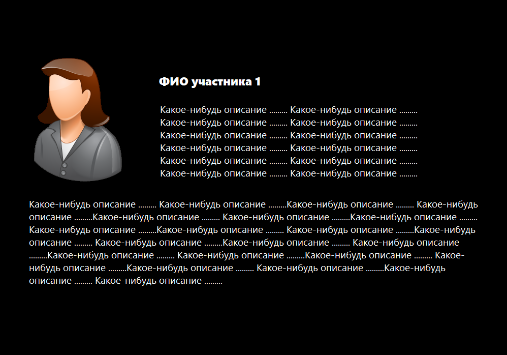
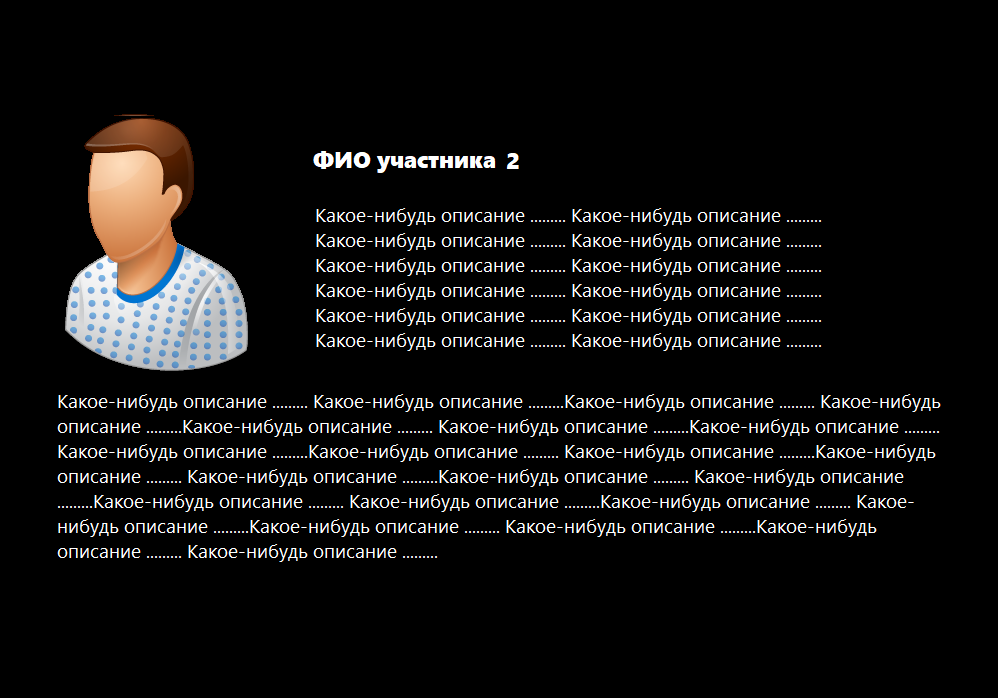
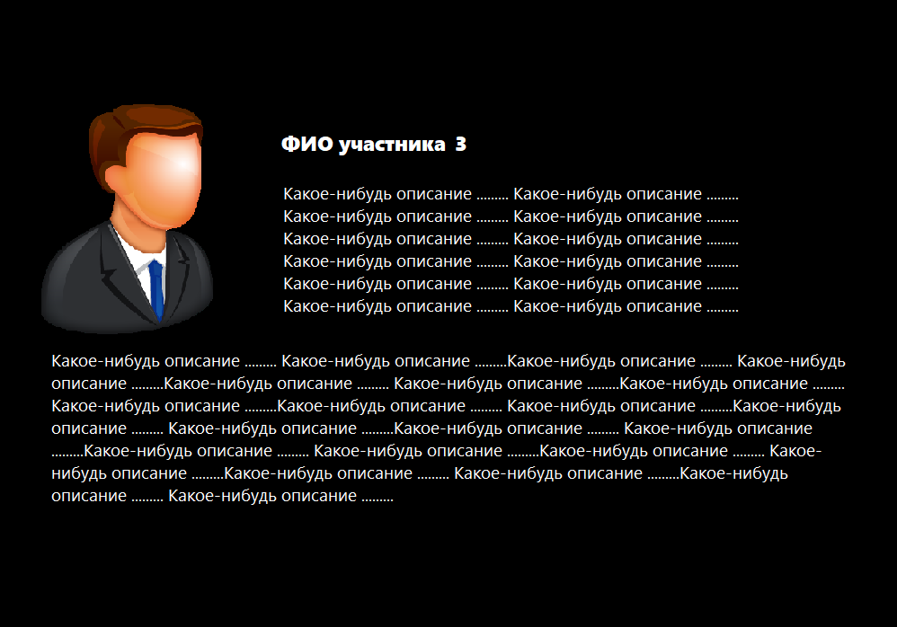
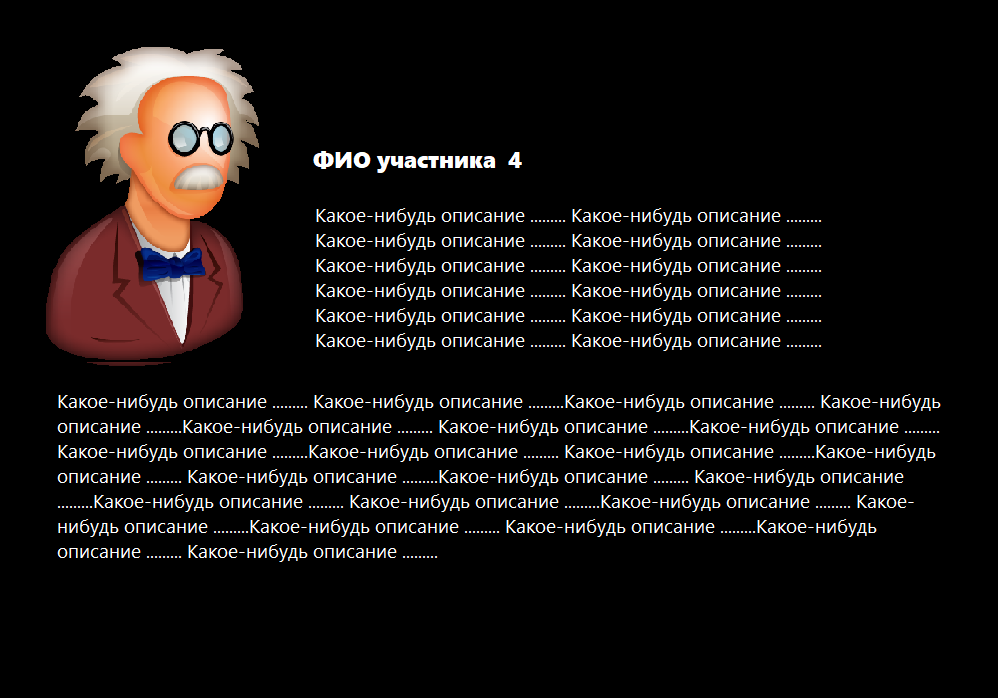
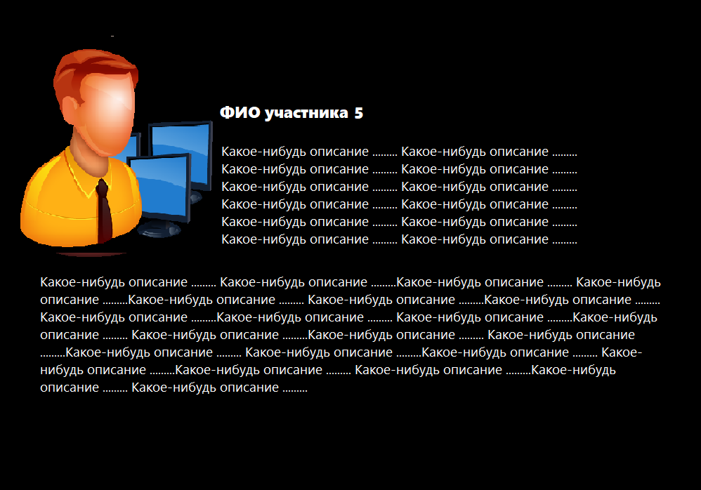
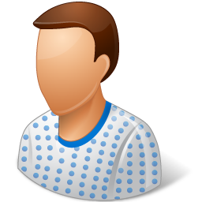
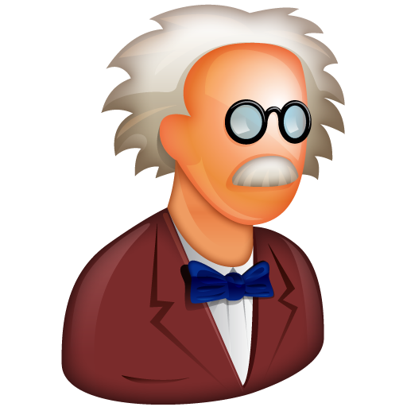

<!DOCTYPE html>
<html lang="ru">
<head>
<meta charset="UTF-8">
<meta name="viewport" content="width=device-width, initial-scale=1.0">
<title>Название команды</title>

</head>
<body>

  <header>
    <h2>Название команды</h2>
    
Лозунг или описание команды 
       Можно сделать в несколько строк   
    

  </header>

  <!-- Карусель -->
  

    

      
      
      
      
      
    

    <button class="btn prev" onclick="moveSlide(-1)">&#10094;</button>
    <button class="btn next" onclick="moveSlide(1)">&#10095;</button>

    

  

  <!-- Миниатюры -->
  

    

      
    

    

      
    

    

      
    

    

      
    

    

      
    

  

  <!-- Контакты -->
  <section class="contacts">
    <h2>Связаться с нами</h2>
    <a href="tel:+79990000000">📞 Позвонить</a>
    <a href="mailto:mail@example.com">✉️ Написать</a>
    <a href="https://t.me/username" target="_blank">💬 Telegram</a>
  </section>

</body>
</html>
это файл Readme
